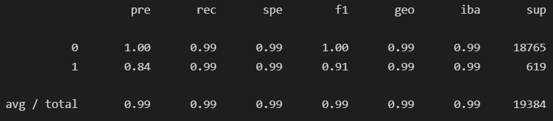

# Supervised Learning Loan Qualification 

## Overview of the Analysis

* This analysis sets out to fine-tune a model that will be used to help a firm determine which loans will be healthy and which are at high-risk for default. 
* The model takes financial information from the clients including income, debt, debt to income ratio, derogatory marks on the account in addition to loan information: loan size and interest rate. Using these categories, the model can predict which accounts are at risk for defaulting based on their categorical value of loan status. 
* The initial model
* The initial model was a logistic regression model that was fitted on non-resampled data, meaning the discrepancy in quantity between categorical values of `0` and `1` were preserved. Instances of the `0` healthy loan category were far more frequent than the high-risk loan category. 
* The second model employed a Random Oversampler method to equalize the instances of the two categories. Meaning that the `1` high-risk loan values were oversampled to appear more frequent in the data. This allowed the model to catch more instances of the high-risk loan in the prediction. 

## Results

* Machine Learning Model 1:
  * Non-Oversampled Logistic Regression:

  * Model 1 performed modestly well with f1 scores of 1.00 and 0.88 respectively for category 0 and category 1 variables.
  * However it performed weaker for the category 1 variable due in large part to the imbalanced data. It had a precision of 0.85 and a recall of 0.91 meaning that it had room to improve in terms of both precisely targeting category 1 outcomes and capturing more true category 1 outcomes.

* Machine Learning Model 2:
  * Random Oversampled Logistic Regression:

  * This model improved on the first model by balancing the categorical data. The model was able to improve on the recall of the model for the category 1 variable while maintaining the same precision. The recall improved from 0.91 to 0.99 for category 1 meaning more of the true category 1 outcomes were captured by the model. The precision decreased from 0.85 to 0.84 for the second model but that is not a significant enough decrease to affect the accuracy of the model.

## Summary

  * Machine Learning Model 2 of oversampling the lesser category of high-risk loans provided a better model which improved the model's ability to accurately predict high-risk loans. 

  * The firm would be better served to identify high-risk loans at a high rate so that it can avoid clients that default to decrease the company's liability and loss. For our model, we want to maximize recall of the category 1 outcomes while maintaining a high recall and precision for our category 0 outcomes. We want to make sure that we can identify bad loans while being able to maintain a robust client base from the good loans. The second machine learning model allows us to accomplish this task better than the first model. The ability of the model to recall 99% of the bad loans is impressive and would be highly valuable to the firm. 
